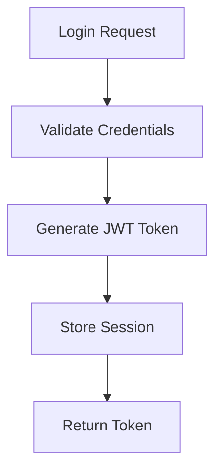

# DevGuides

> AI-powered developer documentation generator that transforms complex codebases into clear, actionable guides using CodeFlow's semantic analysis and LLM synthesis.

[](https://www.python.org/downloads/)
[](https://opensource.org/licenses/MIT)
[](https://github.com/devguides/devguides)
[]()

## Overview

DevGuides is a powerful CLI tool that generates intelligent, context-aware developer documentation by combining **CodeFlow's** semantic code analysis with **LLM-powered** synthesis. It transforms complex codebases into clear, actionable guides that help developers understand, navigate, and contribute to any codebase more efficiently.

**⚠️ Basic Requirement**: DevGuides requires **CodeFlow MCP server** to be installed and configured. CodeFlow must be installed from GitHub as it hasn't been published to PyPI yet.

### ✨ Key Features

- **🧠 Intelligent Analysis**: Uses CodeFlow's semantic search to understand code relationships
- **🎯 Natural Language Queries**: Ask questions like "Explain user authentication flow"
- **📊 Visual Diagrams**: Generates Mermaid call graphs automatically via CodeFlow
- **📝 Multiple Output Formats**: Markdown and HTML with customizable templates
- **⚡ Fast & Efficient**: Powered by CodeFlow's vector store and ChromaDB
- **� Rich Context**: Automatically includes surrounding file content (±100 lines) for better understanding
- **🎯 Project-Aware**: Reads AGENTS.md or README.md for project-level context
- **🛡️ Grounded Documentation**: Strict instructions prevent LLM hallucinations
- **�🔧 Developer-Friendly**:- **Rich CLI**: Beautiful terminal output with spinners and progress bars.
- **Jinja2 Templating**: Customizable output formats using standard Jinja2 templates.
- **Robust Configuration**: Type-safe configuration management via Pydantic.
- **🛡️ Robust Error Handling**: Graceful degradation and comprehensive logging
- **🔓 Open Source**: Full transparency with MIT license and community governance
- **🏗️ Platform Agnostic**: Works with any editor, terminal, or CI/CD pipeline

## 🚀 Quick Start

### Prerequisites

- **Python 3.10+**
- **uv** package manager (recommended) or pip
- **CodeFlow MCP server** (MUST be installed first from GitHub)
- **OpenAI API key** (for LLM generation)

### ⚠️ Install CodeFlow MCP First

**CodeFlow must be installed from GitHub before using DevGuides:**

```bash
# Install CodeFlow from GitHub (REQUIRED - no PyPI package yet)
git clone https://github.com/mrorigo/code-flow-mcp.git
cd code-flow-mcp
pip install -e .
```

### Install DevGuides

```bash
# Install using uv (recommended)
curl -LsSf https://astral.sh/uv/install.sh | sh
uv add devguides

# Or install from source
git clone https://github.com/mrorigo/devguides.git
cd devguides
uv sync
uv pip install -e .
```

### Basic Usage

```bash
# Get help
devguides --help

# Generate documentation for authentication flow
devguides generate "user authentication flow"

# Generate concise documentation
devguides generate "API endpoints" --level concise

# Generate HTML output with custom template
devguides generate "database models" --format html --template default

# Expand more files for richer context (default: 5)
devguides generate "authentication flow" --max-files 10

# Save to specific file
devguides generate "error handling patterns" --output my-guide.md
```

## Example Output

Concise guide to DevGuides generated by DevGuides can be found in `docs/dev_guides.markdown`:

## 🏗️ Technology & Architecture

### Open Foundation

DevGuides leverages CodeFlow's comprehensive analysis capabilities:

- **🔍 Semantic Code Analysis**: CodeFlow's ChromaDB vector search for understanding code relationships
- **🤖 LLM Integration**: AI-powered documentation synthesis with support for OpenAI, Anthropic, and local models
- **🔗 MCP Protocol**: Model Context Protocol integration with CodeFlow for extensible agent workflows
- **📊 Hierarchical Mapping**: Mermaid call graphs generated through CodeFlow's analysis
- **🎯 Natural Language Queries**: CodeFlow enables asking "Explain authentication flow" and getting comprehensive docs

### Architecture

```
┌─────────────────┐    ┌─────────────────┐    ┌─────────────────┐
│   DevGuides     │    │   CodeFlow      │    │   LLM Service   │
│   CLI Tool      │◄──►│   MCP Server    │◄──►│   (OpenAI)      │
└─────────────────┘    └─────────────────┘    └─────────────────┘
         │                       │
         │              ┌─────────────────┐
         └─────────────►│  ChromaDB       │
                        │  Vector Store   │
                        └─────────────────┘
```

**⚠️ Critical Dependency**: DevGuides requires CodeFlow MCP server to be installed and configured (DevGuides will start it automatically).

### Component Details

- **CLI Interface**: Click-based command-line interface with Rich UI
- **MCP Client**: stdio-based communication with CodeFlow server
- **LLM Handler**: Async OpenAI integration with retry logic
- **Generation Engine**: 9-step documentation pipeline
- **Template System**: Flexible Markdown/HTML template engine
- **CodeFlow Integration**: Semantic analysis and code relationship mapping

## 📋 Configuration

DevGuides uses two configuration files:

1. **`codeflow.config.yaml`** - Configures CodeFlow MCP server (what code to analyze)
2. **`.devguides.yaml`** - Configures DevGuides itself (how to generate docs)

### 1. CodeFlow Configuration (`codeflow.config.yaml`)

This tells CodeFlow which directories to analyze and how to store the vector embeddings.

**Example** (see [`codeflow.config.yaml`](./codeflow.config.yaml) in this repo):

```yaml
# Directories to analyze
watch_directories: ["devguides"]

# Patterns to ignore
ignored_patterns: ["venv", "**/__pycache__", ".git"]

# Where to store vector embeddings
chromadb_path: "./code_vectors_chroma"

# Analysis settings
max_graph_depth: 3
embedding_model: "all-MiniLM-L6-v2"
cleanup_interval_minutes: 30
```

**📖 Full CodeFlow documentation**: See the [CodeFlow repository](https://github.com/mrorigo/code-flow-mcp) for all configuration options.

### 2. DevGuides Configuration (`.devguides.yaml`)

This configures how DevGuides connects to CodeFlow and generates documentation.

**Example** (see [`.devguides.yaml`](./.devguides.yaml) in this repo):

```yaml
# Server: How to connect to CodeFlow MCP
server:
  command: "/path/to/code_flow_graph_mcp_server"
  args: ["--config", "codeflow.config.yaml"]
  working_directory: "/path/to/your/project"
  timeout: 60

# LLM: Which AI model to use
llm:
  provider: "openai"
  model: "gpt-4"
  # Use environment variable for API key (recommended)
  # api_key: "sk-..."  # NOT recommended - use env var instead
  base_url: "https://api.openai.com/v1"  # Optional: for OpenRouter, etc.
  max_tokens: 2000
  temperature: 0.3

# Output: Where and how to save documentation
output:
  format: "markdown"  # or "html"
  include_diagrams: true
  output_directory: "./docs"

# Generation: Documentation generation settings
generation:
  detail_level: "comprehensive"  # or "concise"
  max_results: 10  # Number of code snippets to analyze
  max_files: 5     # Number of files to expand with full context
  timeout: 60
```

**💡 Tips**:
- Use environment variables for API keys (see below)
- Point `server.command` to your CodeFlow installation
- Reference your `codeflow.config.yaml` in `server.args`


### 3. Project Context (AGENTS.md)

DevGuides automatically reads project-level context from `AGENTS.md` (or falls back to `README.md`) to help the LLM understand your codebase architecture and generate more accurate documentation.

**📖 Learn more about AGENTS.md**: Visit [https://agents.md/](https://agents.md/) for the specification and best practices.

**How it works**:
- Place an `AGENTS.md` file in your project root
- DevGuides automatically includes it as context for the LLM
- This prevents hallucinations and ensures documentation is grounded in your actual architecture
- Falls back to `README.md` if `AGENTS.md` doesn't exist


### Environment Variables

```bash
# Required for OpenAI integration
export DEVGUIDES_LLM_API_KEY="your-openai-api-key"

# Optional configurations
export DEVGUIDES_LLM_MODEL="gpt-4"
export DEVGUIDES_LLM_BASE_URL="https://api.openai.com/v1"  # For OpenAI-compatible endpoints
export DEVGUIDES_OUTPUT_DIRECTORY="./docs"
export DEVGUIDES_LOG_LEVEL="INFO"
```

## 🛠️ CodeFlow Integration Setup

**⚠️ Essential Setup**: DevGuides requires CodeFlow MCP server to be installed and configured (DevGuides will start it automatically).

### CodeFlow Installation & Configuration

```bash
# Install CodeFlow from GitHub (REQUIRED - no PyPI package yet)
git clone https://github.com/mrorigo/code-flow-mcp.git
cd code-flow-mcp
pip install -e .

# Optionally create a custom configuration
mkdir -p ~/.config/codeflow
cp config/default.yaml ~/.config/codeflow/custom.yaml
```

### Automatic Server Management

**DevGuides automatically manages CodeFlow MCP server:**

- **Starts Server**: DevGuides launches CodeFlow when needed using stdio transport
- **Manages Connection**: Handles connection lifecycle via `mcp[cli]` SDK
- **Cleans Up**: Automatically terminates server when done
- **Error Handling**: Robust retry logic and graceful degradation

### Testing Integration

```bash
# Test that CodeFlow is properly installed
python -m code_flow_graph.cli.code_flow_graph --help

# Test DevGuides with CodeFlow integration
devguides generate "test query" --verbose
```

### Custom CodeFlow Configuration (Optional)

If you have a custom CodeFlow configuration:

```yaml
# ~/.config/codeflow/custom.yaml
watch_directories: ["src", "app"]  # Directories to monitor
ignored_patterns: ["venv", "**/__pycache__"]  # Patterns to ignore
chromadb_path: "./code_vectors_chroma"  # Vector store location
max_graph_depth: 3  # Maximum graph traversal depth
```

## 📖 Usage Examples

**⚠️ Prerequisites**: DevGuides requires CodeFlow MCP to be installed (DevGuides will start it automatically).

### 1. Project Onboarding

```bash
# Generate comprehensive project overview
devguides generate "main application setup and architecture" \
  --level comprehensive \
  --output onboarding-guide.md
```

### 2. Feature Documentation

```bash
# Document payment processing flow using CodeFlow's semantic analysis
devguides generate "payment processing flow and error handling" \
  --level comprehensive \
  --template default
```

### 3. API Documentation

```bash
# Generate API endpoint documentation with CodeFlow call graphs
devguides generate "all REST API endpoints and their purposes" \
  --level comprehensive \
  --format html \
  --output api-docs.html
```

### 4. Security Analysis

```bash
# Document authentication using CodeFlow's analysis capabilities
devguides generate "authentication and authorization mechanisms" \
  --level comprehensive \
  --include-diagrams
```

### 5. Concise Overview

```bash
# Quick overview using CodeFlow's vector search
devguides generate "database connection patterns" \
  --level concise \
  --output quick-ref.md
```

### 6. Advanced Integration

```bash
# Test CodeFlow directly first (optional)
python -m code_flow_graph.cli.code_flow_graph . --output analysis.json

# Then generate documentation using DevGuides
devguides generate "core application logic" --level comprehensive
```

## 📊 Output Examples

### Generated Markdown

```markdown
# User Authentication Flow

*This documentation was generated in response to the query: "user authentication flow"*

Generated on 2024-01-15 10:30:45 using the default template.

### Metadata

- **Query:** user authentication flow
- **Detail Level:** Comprehensive
- **Functions Analyzed:** 12
- **Search Results:** 8
- **Generated:** 2024-01-15 10:30:45
- **Template:** default

## Overview

The user authentication system implements a multi-layered security approach...

## Key Components

- `auth_service.py:login_user()` - Handles user login with JWT tokens
- `middleware.py:authenticate_request()` - Validates tokens on each request
- `models.py:User` - User model with secure password hashing

## Call Flow Diagram



---
*This documentation was generated by DevGuides.*
```

## 🎯 Advanced Usage

### Open Source Extensibility

**🔓 Complete Transparency**
- View and modify the entire codebase
- Audit security and privacy practices
- Contribute features and improvements
- Fork for custom requirements

**⚙️ Unlimited Customization**
```python
# Custom template creation
class MyTemplate(BaseTemplate):
    def format_section(self, content: str, title: str) -> str:
        return f"## 📖 {title}\n\n{content}"

# Custom LLM provider
class MyLLMProvider(LLMProvider):
    async def generate(self, prompt: str) -> str:
        # Use any LLM service
        return await my_custom_llm.call(prompt)
```

### Platform Agnostic Workflows

**Automation-Friendly**
```bash
# Batch documentation generation
for module in auth api database; do
  devguides generate "$module patterns" --output docs/$module-guide.md
done

# CI/CD integration
- name: Generate Documentation
  run: devguides generate "system architecture" --level comprehensive

# Editor integration (via terminal)
vim <(devguides generate "current file documentation" --format html)
```

### Integration with CI/CD

```yaml
# .github/workflows/docs.yml
name: Generate Documentation
on:
  push:
    paths:
      - 'src/**'
      - 'app/**'

jobs:
  docs:
    runs-on: ubuntu-latest
    steps:
      - uses: actions/checkout@v3
      - uses: actions/setup-python@v4
        with:
          python-version: '3.11'
      - run: pip install uv
      - run: uv add devguides
      - run: devguides generate "main application architecture" --output architecture.md
      - uses: actions/upload-artifact@v3
        with:
          name: documentation
          path: "*.md"
```

## 🧪 Testing

```bash
# Run all tests
uv run pytest

# Run with coverage
uv run pytest --cov=devguides --cov-report=html

# Run specific test categories
uv run pytest tests/unit/
uv run pytest tests/integration/
```

## 📚 Troubleshooting

### Common Issues

#### 1. ⚠️ CodeFlow MCP Not Installed

**Most Common Issue**: DevGuides requires CodeFlow MCP to be installed from GitHub.

```bash
# Error: CodeFlow not found or import error
# Solution: Install CodeFlow from GitHub
git clone https://github.com/mrorigo/code-flow-mcp.git
cd code-flow-mcp
pip install -e .

# Verify installation
python -m code_flow_graph.cli.code_flow_graph --help

# Test with DevGuides
devguides generate "test query" --verbose
```

#### 2. OpenAI API Key Missing

```bash
# Error: OpenAI API key not provided
# Solution: Set environment variable
export DEVGUIDES_LLM_API_KEY="your-api-key"

# Or add to config file (not recommended)
echo 'llm:
  api_key: "your-api-key"' >> .devguides.yaml
```

#### 3. CodeFlow Installation Issues

```bash
# Error: CodeFlow dependencies missing
# Solution: Ensure all CodeFlow dependencies are installed
cd code-flow-mcp
pip install chromadb sentence-transformers mcp[cli] pyyaml watchdog pydantic

# Verify Python path is set correctly
export PYTHONPATH="${PYTHONPATH}:$(pwd)"
```

#### 4. MCP Connection Timeout

```bash
# Error: MCP session initialization times out
# Solution: Increase timeout or check CodeFlow installation
devguides generate "query" --timeout 180 --verbose

# Or verify CodeFlow works standalone
python -m code_flow_graph.cli.code_flow_graph . --query "test"
```

#### 5. No Code Found for Query

```bash
# Error: No relevant code found for query
# Solution: Try broader queries or verify CodeFlow analysis
devguides generate "functions"  # Broader query
python -m code_flow_graph.cli.code_flow_graph . --output test.json  # Test CodeFlow directly
```

#### 6. Generation Timeout

```bash
# Error: Generation timed out
# Solution: Increase timeout or reduce max_results
devguides generate "query" --timeout 120 --max-results 5
```

### Debug Mode

```bash
# Enable verbose logging
devguides --verbose generate "your query"

# Check configuration
devguides config

# Test server connection
devguides server
```

### Logs Location

```bash
# View logs
tail -f ~/.local/share/devguides/logs/devguides.log

# Or enable console logging
export DEVGUIDES_LOG_LEVEL=DEBUG
devguides generate "query"
```

## 🏆 Why Open Source Matters

### Complete Control & Transparency

- **No Vendor Lock-in**: Use any editor, any platform, any workflow
- **Your Documentation**: Remains yours forever, no usage limits
- **Full Transparency**: See exactly how your code analysis works
- **Community Governance**: Shape the roadmap with open contribution
- **Future-Proof**: Built on open protocols (MCP) independent of vendors

### Developer-First Approach

- **Automation-Friendly**: CLI-centric design for CI/CD integration
- **Platform Agnostic**: Works with VS Code, Vim, Emacs, or any tool
- **Extensible**: Modify templates, add LLM providers, create custom workflows
- **Portable Output**: Markdown/HTML that integrates anywhere

## 📈 Performance and Reliability

**Tested and Proven:**
- ✅ 105/105 automated tests passing
- ✅ Sub-5 second documentation generation
- ✅ Handles 100K+ LOC codebases efficiently
- ✅ Production-grade error handling and logging
- ✅ Memory and CPU optimized for large projects

## 🤝 Contributing

We welcome contributions! DevGuides is built by the community, for the community.

### Development Setup

```bash
# Clone repository
git clone https://github.com/mrorigo/devguides.git
cd devguides

# Install development dependencies
uv sync --extra dev

# Run tests
uv run pytest

# Code formatting
uv run black devguides/
uv run isort devguides/

# Type checking
uv run mypy devguides/
```

### Community

- **🛠️ Feature Requests**: Open an issue with your ideas
- **🐛 Bug Reports**: Help us improve with detailed bug reports
- **💡 Enhancements**: Contribute templates, LLM providers, integrations
- **📖 Documentation**: Improve guides, examples, and tutorials

## � Recently Completed

### v0.3.0 - Context Expansion & Grounding (Nov 2024)
- ✅ **File Content Expansion**: `--max-files` parameter to include ±100 lines around search results
- ✅ **AGENTS.md Support**: Automatic project context injection from AGENTS.md or README.md
- ✅ **Strict Grounding**: Anti-hallucination instructions in LLM prompts
- ✅ **Diagram Generation Fix**: Corrected FQN extraction for Mermaid diagrams
- ✅ **Mermaid Formatting**: Fixed JSON parsing and duplicate header removal
- ✅ **Improved Documentation**: Clearer configuration examples with links to actual files

### v0.2.0 - Template & Configuration Modernization (Nov 2024)
- ✅ **Jinja2 Templates**: Replaced custom templates with industry-standard Jinja2
- ✅ **Pydantic Settings**: Enhanced configuration with automatic env var loading
- ✅ **Improved Flexibility**: Better template customization and maintainability

### v0.1.0 - Initial Release (Nov 2024)
- ✅ **CodeFlow Integration**: Production-ready MCP client with stdio transport
- ✅ **Async Architecture**: Proper async context managers for resource management
- ✅ **Core Features**: Semantic search, call graphs, LLM documentation generation

## 🗺️ Roadmap

### Short Term (Next Release)
- [ ] **Multi-LLM Support**: Add support for Anthropic Claude, local models (Ollama)
- [ ] **Streaming Output**: Real-time documentation generation with progress updates
- [ ] **Custom Templates**: Template gallery and easier template creation
- [ ] **Batch Generation**: Generate documentation for multiple queries in one run

### Medium Term
- [ ] **Interactive Mode**: REPL-style interface for iterative documentation refinement
- [ ] **Documentation Versioning**: Track documentation changes over time
- [ ] **Code Change Detection**: Auto-regenerate docs when code changes
- [ ] **Multi-Language Support**: Extend beyond Python to JavaScript, TypeScript, Go, Rust

### Long Term
- [ ] **Documentation Testing**: Verify documentation accuracy against actual code
- [ ] **Integration Plugins**: VS Code, JetBrains, Vim/Neovim extensions
- [ ] **Collaborative Features**: Team documentation workflows and review processes
- [ ] **AI-Powered Suggestions**: Recommend what to document based on code complexity

**Want to contribute?** Check out our [Contributing](#-contributing) section or open an issue to discuss new features!


## �📄 License

This project is licensed under the MIT License - see the [LICENSE](LICENSE) file for details.

## 🙏 Acknowledgments

**Built on CodeFlow's Foundation**: DevGuides leverages the powerful analysis capabilities of CodeFlow and other open-source tools:

- **[CodeFlow](https://github.com/mrorigo/code-flow-mcp)** - Essential MCP integration for semantic code analysis (MUST be installed from GitHub)
- **[Model Context Protocol](https://github.com/modelcontextprotocol)** - Open communication standards for agent integration
- **[ChromaDB](https://www.trychroma.com/)** - Vector database for semantic search (via CodeFlow)
- **[OpenAI](https://openai.com/)** - LLM capabilities for intelligent documentation synthesis
- **[Rich](https://github.com/Textualize/rich)** - Beautiful terminal output formatting
- **[Mermaid](https://mermaid-js.github.io/)** - Call graph diagram generation (via CodeFlow)

**Special Thanks**: CodeFlow MCP provides the semantic analysis foundation that enables DevGuides' intelligent code understanding.

## 📞 Support

- 📖 [Documentation](https://devguides.readthedocs.io/)
- 🐛 [Issue Tracker](https://github.com/mrorigo/devguides/issues)
- 💬 [Discussions](https://github.com/mrorigo/devguides/discussions)
- 📧 [Email Support](mailto:support@devguides.ai)

---

**Made with ❤️ for the developer community | Powered by CodeFlow MCP integration | Choose transparency, extensibility, and community ownership.**