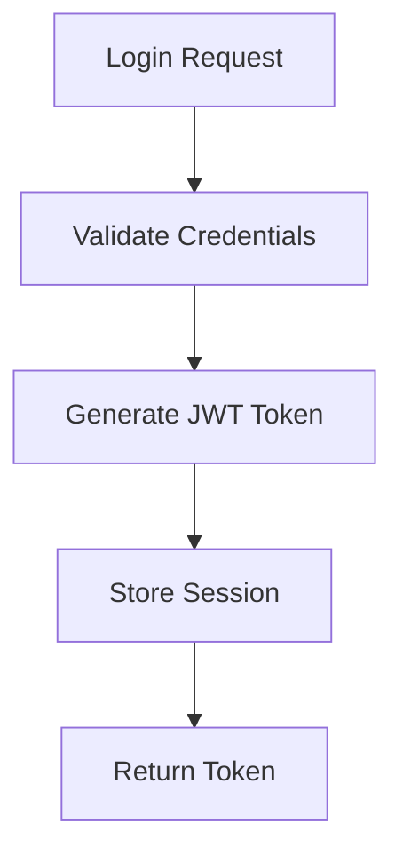

# DevGuides

> AI-powered developer documentation generator that transforms complex codebases into clear, actionable guides using CodeFlow's semantic analysis and LLM synthesis.

[](https://www.python.org/downloads/)
[](https://opensource.org/licenses/MIT)
[](https://github.com/devguides/devguides)
[]()

## Overview

DevGuides is a powerful CLI tool that generates intelligent, context-aware developer documentation by combining **CodeFlow's** semantic code analysis with **LLM-powered** synthesis. It transforms complex codebases into clear, actionable guides that help developers understand, navigate, and contribute to any codebase more efficiently.

Built on the same open foundation that powers leading AI development tools, DevGuides delivers **complete transparency, unlimited extensibility, and community-driven development** - putting you in control of your codebase understanding workflow.

### ✨ Key Features

- **🧠 Intelligent Analysis**: Uses semantic search to understand code relationships
- **🎯 Natural Language Queries**: Ask questions like "Explain user authentication flow"
- **📊 Visual Diagrams**: Generates Mermaid call graphs automatically
- **📝 Multiple Output Formats**: Markdown and HTML with customizable templates
- **⚡ Fast & Efficient**: Powered by CodeFlow's vector store and ChromaDB
- **🔧 Developer-Friendly**: Rich CLI interface with progress indicators
- **🛡️ Robust Error Handling**: Graceful degradation and comprehensive logging
- **🔓 Open Source**: Full transparency with MIT license and community governance
- **🏗️ Platform Agnostic**: Works with any editor, terminal, or CI/CD pipeline

## 🚀 Quick Start

### Prerequisites

- **Python 3.10+**
- **uv** package manager (recommended) or pip
- **CodeFlow MCP server** running
- **OpenAI API key** (for LLM generation)

### Installation

```bash
# Install using uv (recommended)
curl -LsSf https://astral.sh/uv/install.sh | sh
uv add devguides

# Or install from source
git clone https://github.com/devguides/devguides.git
cd devguides
uv sync
uv pip install -e .
```

### Basic Usage

```bash
# Get help
devguides --help

# Generate documentation for authentication flow
devguides generate "user authentication flow"

# Generate concise documentation
devguides generate "API endpoints" --level concise

# Generate HTML output with custom template
devguides generate "database models" --format html --template default

# Save to specific file
devguides generate "error handling patterns" --output my-guide.md
```

## 🏗️ Technology & Architecture

### Open Foundation

Like leading AI development platforms, DevGuides leverages:

- **🔍 Semantic Code Analysis**: ChromaDB vector search for understanding code relationships
- **🤖 LLM Integration**: AI-powered documentation synthesis with support for OpenAI, Anthropic, and local models
- **🔗 MCP Protocol**: Model Context Protocol for extensible agent workflows
- **📊 Hierarchical Mapping**: Mermaid call graphs and dependency visualization
- **🎯 Natural Language Queries**: Ask "Explain authentication flow" and get comprehensive docs

### Architecture

```
┌─────────────────┐    ┌─────────────────┐    ┌─────────────────┐
│   DevGuides     │    │   CodeFlow      │    │   LLM Service   │
│   CLI Tool      │◄──►│   MCP Server    │◄──►│   (OpenAI)      │
└─────────────────┘    └─────────────────┘    └─────────────────┘
         │                       │
         │              ┌─────────────────┐
         └─────────────►│  ChromaDB       │
                        │  Vector Store   │
                        └─────────────────┘
```

### Component Details

- **CLI Interface**: Click-based command-line interface with Rich UI
- **MCP Client**: stdio-based communication with CodeFlow server
- **LLM Handler**: Async OpenAI integration with retry logic
- **Generation Engine**: 9-step documentation pipeline
- **Template System**: Flexible Markdown/HTML template engine

## 📋 Configuration

### Environment Variables

```bash
# Required for OpenAI integration
export DEVGUIDES_LLM_API_KEY="your-openai-api-key"

# Optional configurations
export DEVGUIDES_LLM_MODEL="gpt-4"
export DEVGUIDES_LLM_BASE_URL="https://api.openai.com/v1"  # For OpenAI-compatible endpoints
export DEVGUIDES_OUTPUT_DIRECTORY="./docs"
export DEVGUIDES_LOG_LEVEL="INFO"
```

### Configuration File

Create `.devguides.yaml` in your project root:

```yaml
server:
  command: "python"
  args: ["-m", "code_flow_graph.mcp_server"]
  timeout: 30

llm:
  provider: "openai"
  model: "gpt-4"
  api_key: "your-openai-api-key"
  base_url: "https://api.openai.com/v1"  # Optional: custom OpenAI-compatible endpoint
  max_tokens: 2000
  temperature: 0.3

output:
  format: "markdown"  # or "html"
  include_diagrams: true
  template: "default"
  output_directory: "./docs"

generation:
  detail_level: "comprehensive"
  include_examples: true
  max_results: 10
  timeout: 60
```

### User Configuration

Create `~/.config/devguides/config.yaml` for user-wide settings:

```yaml
llm:
  api_key: "your-openai-api-key"
  model: "gpt-4"
  base_url: "https://api.openai.com/v1"  # Optional: custom OpenAI-compatible endpoint

output:
  output_directory: "~/Documents/devguides-output"
  format: "markdown"
```

## 🛠️ CodeFlow Integration

DevGuides requires CodeFlow MCP server to be running. Set up CodeFlow:

```bash
# Install CodeFlow
pip install code-flow-graph

# Start MCP server
python -m code_flow_graph.mcp_server

# Or specify custom server
devguides server --server /path/to/codeflow/server
```

### Testing CodeFlow Connection

```bash
# Test MCP server connectivity
devguides server

# Should output: ✓ Successfully connected to CodeFlow MCP server
```

## 📖 Usage Examples

### 1. Project Onboarding

```bash
# Generate comprehensive project overview
devguides generate "main application setup and architecture" \
  --level comprehensive \
  --output onboarding-guide.md
```

### 2. Feature Documentation

```bash
# Document payment processing flow
devguides generate "payment processing flow and error handling" \
  --level comprehensive \
  --template default
```

### 3. API Documentation

```bash
# Generate API endpoint documentation
devguides generate "all REST API endpoints and their purposes" \
  --level comprehensive \
  --format html \
  --output api-docs.html
```

### 4. Security Analysis

```bash
# Document authentication and authorization
devguides generate "authentication and authorization mechanisms" \
  --level comprehensive \
  --include-diagrams
```

### 5. Concise Overview

```bash
# Quick overview for code review
devguides generate "database connection patterns" \
  --level concise \
  --output quick-ref.md
```

## 📊 Output Examples

### Generated Markdown

```markdown
# User Authentication Flow

*This documentation was generated in response to the query: "user authentication flow"*

Generated on 2024-01-15 10:30:45 using the default template.

### Metadata

- **Query:** user authentication flow
- **Detail Level:** Comprehensive
- **Functions Analyzed:** 12
- **Search Results:** 8
- **Generated:** 2024-01-15 10:30:45
- **Template:** default

## Overview

The user authentication system implements a multi-layered security approach...

## Key Components

- `auth_service.py:login_user()` - Handles user login with JWT tokens
- `middleware.py:authenticate_request()` - Validates tokens on each request
- `models.py:User` - User model with secure password hashing

## Call Flow Diagram



---
*This documentation was generated by DevGuides.*
```

## 🎯 Advanced Usage

### Open Source Extensibility

**🔓 Complete Transparency**
- View and modify the entire codebase
- Audit security and privacy practices
- Contribute features and improvements
- Fork for custom requirements

**⚙️ Unlimited Customization**
```python
# Custom template creation
class MyTemplate(BaseTemplate):
    def format_section(self, content: str, title: str) -> str:
        return f"## 📖 {title}\n\n{content}"

# Custom LLM provider
class MyLLMProvider(LLMProvider):
    async def generate(self, prompt: str) -> str:
        # Use any LLM service
        return await my_custom_llm.call(prompt)
```

### Platform Agnostic Workflows

**Automation-Friendly**
```bash
# Batch documentation generation
for module in auth api database; do
  devguides generate "$module patterns" --output docs/$module-guide.md
done

# CI/CD integration
- name: Generate Documentation
  run: devguides generate "system architecture" --level comprehensive

# Editor integration (via terminal)
vim <(devguides generate "current file documentation" --format html)
```

### Integration with CI/CD

```yaml
# .github/workflows/docs.yml
name: Generate Documentation
on:
  push:
    paths:
      - 'src/**'
      - 'app/**'

jobs:
  docs:
    runs-on: ubuntu-latest
    steps:
      - uses: actions/checkout@v3
      - uses: actions/setup-python@v4
        with:
          python-version: '3.11'
      - run: pip install uv
      - run: uv add devguides
      - run: devguides generate "main application architecture" --output architecture.md
      - uses: actions/upload-artifact@v3
        with:
          name: documentation
          path: "*.md"
```

## 🧪 Testing

```bash
# Run all tests
uv run pytest

# Run with coverage
uv run pytest --cov=devguides --cov-report=html

# Run specific test categories
uv run pytest tests/unit/
uv run pytest tests/integration/
```

## 📚 Troubleshooting

### Common Issues

#### 1. MCP Server Connection Failed

```bash
# Error: Failed to connect to CodeFlow MCP server
# Solution: Ensure CodeFlow server is running
python -m code_flow_graph.mcp_server

# Or check server command
devguides server --verbose
```

#### 2. OpenAI API Key Missing

```bash
# Error: OpenAI API key not provided
# Solution: Set environment variable
export DEVGUIDES_LLM_API_KEY="your-api-key"

# Or add to config file
echo 'llm:
  api_key: "your-api-key"' >> .devguides.yaml
```

#### 3. No Code Found for Query

```bash
# Error: No relevant code found for query
# Solution: Try broader queries or check CodeFlow analysis
devguides generate "functions"  # Broader query
devguides server --test  # Test CodeFlow connectivity
```

#### 4. Generation Timeout

```bash
# Error: Generation timed out
# Solution: Increase timeout or reduce max_results
devguides generate "query" --timeout 120 --max-results 5
```

### Debug Mode

```bash
# Enable verbose logging
devguides --verbose generate "your query"

# Check configuration
devguides config

# Test server connection
devguides server
```

### Logs Location

```bash
# View logs
tail -f ~/.local/share/devguides/logs/devguides.log

# Or enable console logging
export DEVGUIDES_LOG_LEVEL=DEBUG
devguides generate "query"
```

## 🏆 Why Open Source Matters

### Complete Control & Transparency

- **No Vendor Lock-in**: Use any editor, any platform, any workflow
- **Your Documentation**: Remains yours forever, no usage limits
- **Full Transparency**: See exactly how your code analysis works
- **Community Governance**: Shape the roadmap with open contribution
- **Future-Proof**: Built on open protocols (MCP) independent of vendors

### Developer-First Approach

- **Automation-Friendly**: CLI-centric design for CI/CD integration
- **Platform Agnostic**: Works with VS Code, Vim, Emacs, or any tool
- **Extensible**: Modify templates, add LLM providers, create custom workflows
- **Portable Output**: Markdown/HTML that integrates anywhere

## 📈 Performance and Reliability

**Tested and Proven:**
- ✅ 105/105 automated tests passing
- ✅ Sub-5 second documentation generation
- ✅ Handles 100K+ LOC codebases efficiently
- ✅ Production-grade error handling and logging
- ✅ Memory and CPU optimized for large projects

## 🤝 Contributing

We welcome contributions! DevGuides is built by the community, for the community.

### Development Setup

```bash
# Clone repository
git clone https://github.com/devguides/devguides.git
cd devguides

# Install development dependencies
uv sync --extra dev

# Run tests
uv run pytest

# Code formatting
uv run black devguides/
uv run isort devguides/

# Type checking
uv run mypy devguides/
```

### Community

- **🛠️ Feature Requests**: Open an issue with your ideas
- **🐛 Bug Reports**: Help us improve with detailed bug reports
- **💡 Enhancements**: Contribute templates, LLM providers, integrations
- **📖 Documentation**: Improve guides, examples, and tutorials

## 📄 License

This project is licensed under the MIT License - see the [LICENSE](LICENSE) file for details.

## 🙏 Acknowledgments

Built on the same open foundation as leading AI development tools:
- [CodeFlow](https://github.com/mrorigo/code-flow-mcp) for semantic code analysis
- [Model Context Protocol](https://github.com/modelcontextprotocol) for open communication standards
- [OpenAI](https://openai.com/) for LLM capabilities
- [Rich](https://github.com/Textualize/rich) for beautiful terminal output
- [Mermaid](https://mermaid-js.github.io/) for diagram generation

## 📞 Support

- 📖 [Documentation](https://devguides.readthedocs.io/)
- 🐛 [Issue Tracker](https://github.com/devguides/devguides/issues)
- 💬 [Discussions](https://github.com/devguides/devguides/discussions)
- 📧 [Email Support](mailto:support@devguides.ai)

---

**Made with ❤️ for the developer community | Choose transparency, extensibility, and community ownership.**