# DevGuides Developer Guide

*This documentation was generated in response to the query: "dev guides"*

Generated on 2025-11-20 16:20:00 using the default template.

### Metadata

- **Query:** dev guides
- **Detail Level:** Concise
- **Functions Analyzed:** 5
- **Search Results:** 5
- **Generated:** 2025-11-20 16:20:00
- **Template:** default

# DevGuides Developer Guide

## Overview
DevGuides is an AI-powered developer documentation generator. It uses semantic code search, call graph analysis, LLM generation, and templating to produce documentation (e.g., Markdown/HTML) for natural language queries like "dev guides". The core pipeline is in `core/engine.py`, orchestrated via CLI in `cli/commands.py`. It integrates CodeFlow MCP for code analysis and OpenAI-compatible LLMs for content synthesis.

## Key Components
- **`DocumentationEngine.generate`** (core/engine.py:48-208, async method): Main entry point. Orchestrates search, context building, LLM calls, and templating. High complexity (19), handles timeouts/exceptions.
- **`cli.commands.cli`** (cli/commands.py:28-59): CLI group entry point with Click decorators. Sets up logging/config.
- **`cli.commands.load_config`** (cli/commands.py:256-304): Loads config with fallback (env > user > project > default).
- **`config.config.merge`** (config/config.py:189-201): Merges configs for CLI overrides.
- **`core.llm_handler._build_prompt`** (core/llm_handler.py:172-254): Constructs structured prompts from query/context.
- **Call Graph**: 69 functions, 49 edges; central hub is `generate` (2 in, 9 out).

See the [Mermaid call flow diagram](#mermaid-diagram) for relationships.

## Detailed Analysis
1. **CLI Entry**: `cli` loads config via `load_config` (env/project fallbacks, merges), sets logging.
2. **Generation (`generate`)**:
   - Validates request (`_validate_request`).
   - Connects MCP client (`connect`), runs semantic search (`semantic_search`).
   - Fetches call graph (`get_call_graph`), function metadata (`get_function_metadata`), Mermaid diagram (`generate_mermaid_graph`).
   - Expands context (`_expand_search_results` → `_merge_ranges`), builds LLM context (`_build_context` → `_get_project_context`).
   - Generates content (`llm_handler.generate_documentation` → `_build_prompt`).
   - Applies Jinja2 template (`_apply_template` → `_convert_markdown_to_html`).
3. **Cleanup**: Disconnects MCP (`disconnect`).
4. **Error Handling**: Retries, timeouts, fallbacks throughout.

## Usage Examples
CLI-driven (no direct Python API in context):

```bash
# Generate docs (uses default config)
devguides generate "dev guides" --level comprehensive --format markdown --output docs.md

# Verbose with custom config
devguides -v -c config.yaml generate "core engine" --no-diagrams --max-results 5

# Check config/server
devguides config
devguides server --server /path/to/mcp
```

In code (inferred from CLI; instantiate via config):
```python
from core.engine import DocumentationEngine
from core.mcp_client import CodeFlowMCPClient
from core.llm_handler import LLMHandler
# engine = DocumentationEngine(mcp_client, llm_handler)
# result = await engine.generate(request)
```

## Related Components
- **MCP Client** (`core/mcp_client.py`): Handles CodeFlow server (connect/search/graph/ping).
- **LLM Handler** (`core/llm_handler.py`): OpenAI provider, prompt building, retries.
- **Config** (`config/config.py`): Pydantic models, validators, merging.
- **Utils**: Logging (`utils/logging.py`), error decorators (`utils/error_handling.py`).
- **Edges**: `generate` → MCP methods (search/graph), LLM (`generate_documentation`), internal helpers.

```mermaid
graph TD
%% Alias: _generate = cli.commands._generate (Function: _generate)
%% Alias: _test_connection = cli.commands._test_connection (Function: _test_connection)
%% Alias: cli = cli.commands.cli (Function: cli)
cli --> load_config
cli --> configure_for_cli
load_config --> config.config.from_env
load_config --> config.config.merge
load_config --> config.config.from_file
generate --> core.engine._validate_request
generate --> core.mcp_client.connect
generate --> core.mcp_client.semantic_search
generate --> core.mcp_client.get_call_graph
generate --> core.mcp_client.get_function_metadata
generate --> core.mcp_client.generate_mermaid_graph
generate --> core.engine._expand_search_results
generate --> core.llm_handler.generate_documentation
generate --> core.engine._apply_template
core.engine._expand_search_results --> core.engine._merge_ranges
core.engine._apply_template --> core.engine._convert_markdown_to_html
core.llm_handler.generate_documentation --> core.llm_handler._build_prompt
core.engine.validate_configuration --> core.mcp_client.ping
```

<a id="mermaid-diagram"></a>


*Analysis


## Call Flow Diagram

The following diagram shows the relationship between the key functions and components:

```mermaid
graph TD
%% Alias: _generate = cli.commands._generate (Function: _generate)
%% Alias: _test_connection = cli.commands._test_connection (Function: _test_connection)
%% Alias: cli = cli.commands.cli (Function: cli)
%% Alias: config = cli.commands.config (Function: config)
%% Alias: generate = cli.commands.generate (Function: generate)
%% Alias: generate_output_path = cli.commands.generate_output_path (Function: generate_output_path)
%% Alias: load_config = cli.commands.load_config (Function: load_config)
%% Alias: server = cli.commands.server (Function: server)
%% Alias: from_env = config.config.from_env (Function: from_env)
%% Alias: from_file = config.config.from_file (Function: from_file)
%% Alias: get_server_command = config.config.get_server_command (Function: get_server_command)
%% Alias: merge = config.config.merge (Function: merge)
%% Alias: validate_config = config.config.validate_config (Function: validate_config)
%% Alias: _apply_template = core.engine._apply_template (Function: _apply_template)
%% Alias: _build_context = core.engine._build_context (Function: _build_context)
%% Alias: _convert_markdown_to_html = core.engine._convert_markdown_to_html (Function: _convert_markdown_to_html)
%% Alias: _expand_search_results = core.engine._expand_search_results (Function: _expand_search_results)
%% Alias: _get_project_context = core.engine._get_project_context (Function: _get_project_context)
%% Alias: _merge_ranges = core.engine._merge_ranges (Function: _merge_ranges)
%% Alias: _validate_request = core.engine._validate_request (Function: _validate_request)
%% Alias: engine_generate = core.engine.generate (Function: generate)
%% Alias: validate_configuration = core.engine.validate_configuration (Function: validate_configuration)
%% Alias: __init__ = core.llm_handler.__init__ (Function: __init__)
%% Alias: _build_prompt = core.llm_handler._build_prompt (Function: _build_prompt)
%% Alias: _create_provider = core.llm_handler._create_provider (Function: _create_provider)
%% Alias: llm_handler_generate = core.llm_handler.generate (Function: generate)
%% Alias: generate_documentation = core.llm_handler.generate_documentation (Function: generate_documentation)
%% Alias: is_available = core.llm_handler.is_available (Function: is_available)
%% Alias: provider_available = core.llm_handler.provider_available (Function: provider_available)
%% Alias: connect = core.mcp_client.connect (Function: connect)
%% Alias: disconnect = core.mcp_client.disconnect (Function: disconnect)
%% Alias: generate_mermaid_graph = core.mcp_client.generate_mermaid_graph (Function: generate_mermaid_graph)
%% Alias: get_call_graph = core.mcp_client.get_call_graph (Function: get_call_graph)
%% Alias: get_function_metadata = core.mcp_client.get_function_metadata (Function: get_function_metadata)
%% Alias: ping = core.mcp_client.ping (Function: ping)
%% Alias: semantic_search = core.mcp_client.semantic_search (Function: semantic_search)
%% Alias: acquire = utils.error_handling.acquire (Function: acquire)
%% Alias: func_call = utils.error_handling.call (Function: call)
%% Alias: on_failure = utils.error_handling.on_failure (Function: on_failure)
%% Alias: on_success = utils.error_handling.on_success (Function: on_success)
%% Alias: configure_for_cli = utils.logging.configure_for_cli (Function: configure_for_cli)
%% Alias: setup_logging = utils.logging.setup_logging (Function: setup_logging)

    _generate("_generate")
    _test_connection("_test_connection")
    cli("cli")
    config("config")
    generate("generate")
    generate_output_path("generate_output_path")
    load_config("load_config")
    server("server")
    from_env("from_env")
    from_file("from_file")
    get_server_command("get_server_command")
    merge("merge")
    validate_config("validate_config")
    _apply_template("_apply_template")
    _build_context("_build_context")
    _convert_markdown_to_html("_convert_markdown_to_html")
    _expand_search_results("_expand_search_results")
    _get_project_context("_get_project_context")
    _merge_ranges("_merge_ranges")
    _validate_request("_validate_request")
    engine_generate("generate")
    validate_configuration("validate_configuration")
    __init__("__init__")
    _build_prompt("_build_prompt")
    _create_provider("_create_provider")
    llm_handler_generate("generate")
    generate_documentation("generate_documentation")
    is_available("is_available")
    provider_available("provider_available")
    connect("connect")
    disconnect("disconnect")
    generate_mermaid_graph("generate_mermaid_graph")
    get_call_graph("get_call_graph")
    get_function_metadata("get_function_metadata")
    ping("ping")
    semantic_search("semantic_search")
    acquire("acquire")
    func_call("call")
    on_failure("on_failure")
    on_success("on_success")
    configure_for_cli("configure_for_cli")
    setup_logging("setup_logging")
    engine_generate --> |Line 59| _validate_request
    engine_generate --> |Line 63| connect
    engine_generate --> |Line 66| semantic_search
    engine_generate --> |Line 105| get_call_graph
    engine_generate --> |Line 114| get_function_metadata
    engine_generate --> |Line 123| generate_mermaid_graph
    engine_generate --> |Line 135| _expand_search_results
    engine_generate --> |Line 151| generate_documentation
    engine_generate --> |Line 158| _apply_template
    _build_context --> |Line 251| _get_project_context
    _expand_search_results --> |Line 325| _merge_ranges
    _apply_template --> |Line 414| _convert_markdown_to_html
    validate_configuration --> |Line 506| ping
    connect --> |Line 45| disconnect
    llm_handler_generate --> |Line 68| is_available
    __init__ --> |Line 103| _create_provider
    generate_documentation --> |Line 147| _build_prompt
    generate_documentation --> |Line 161| generate
    provider_available --> |Line 261| is_available
    configure_for_cli --> |Line 120| setup_logging
    func_call --> |Line 102| on_success
    func_call --> |Line 105| on_failure
    acquire --> |Line 142| acquire
    cli --> |Line 47| configure_for_cli
    cli --> |Line 54| load_config
    generate --> |Line 125| engine_generate
    generate --> |Line 132| generate_output_path
    generate --> |Line 170| disconnect
    generate --> |Line 172| _generate
    _generate --> |Line 125| engine_generate
    _generate --> |Line 132| generate_output_path
    _generate --> |Line 170| disconnect
    config --> |Line 213| validate_config
    server --> |Line 233| get_server_command
    server --> |Line 246| connect
    server --> |Line 267| disconnect
    server --> |Line 269| _test_connection
    _test_connection --> |Line 246| connect
    _test_connection --> |Line 267| disconnect
    load_config --> |Line 283| from_env
    load_config --> |Line 284| merge
    load_config --> |Line 290| from_file
    load_config --> |Line 291| merge
    load_config --> |Line 299| from_file
    load_config --> |Line 300| merge
    load_config --> |Line 306| from_file
    load_config --> |Line 307| merge
    load_config --> |Line 320| from_file
    load_config --> |Line 321| merge
```




---

*This documentation was generated by DevGuides. For questions or issues, please refer to your codebase or DevGuides documentation.*